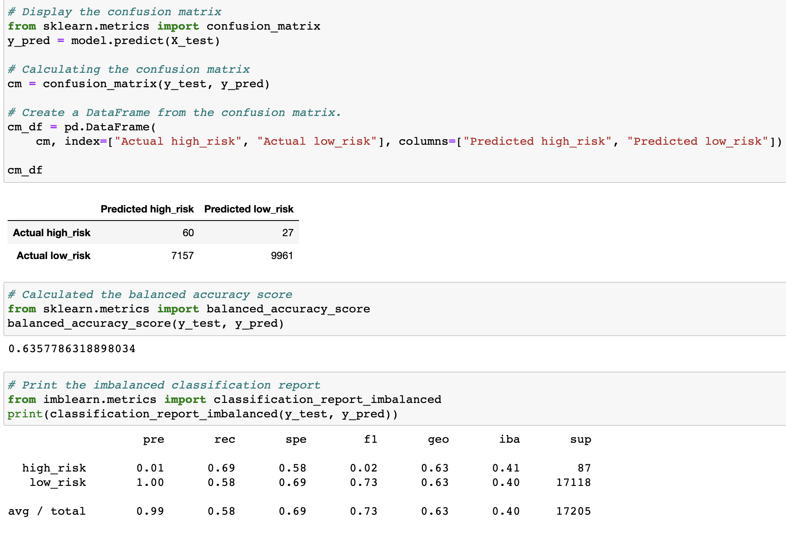

# Credit Risk Analysis
Machine Learning

## Overview of the Analysis

Personal loans and credit cards are an essential part of modern society. All over the world, people rely on their credit worthiness to qualify for loans and credit cards. The process presents a challenge or opportunity for banks and lending institutions. 

Loans and credit card approvals enable lending institutions to create revenue with the interest it generates, but also expose them to risk of losing money if the borrower can't repay its debt. 

To identify risky borrowers, more lending institutions are relying on financial technology, which enables the use of Machine Learning to assess lending risk. Machine learning is believed to lead a more accurate description of borrower's credit worthiness in order to lower default rates.

The purpose of this analysis was to apply Machine Learning to real-world challenge: credit card risk.
The assignment required Python and Scikit-learn to predict credit risk. Several machine learning models were built and evaluated on how well it classified and predicted the data.

## Results

#### Credi Risk Resampling

### Fig.1
***Naive Random Oversampling***

- Balance accuracy score - 64%
- Precision scores <> high-risk 0.01 <> low-risk 1.00
- Recall scores <> high-risk 0.59 <> low-risk 0.69
- Avg/Total 99% for precision & 69% for recall (sensitivity)

### Fig.2
***SMOTE Oversampling***

- Balance accuracy score - 62%
- Precision scores <> high-risk 0.01 <> low-risk 1.00
- Recall scores <> high-risk 0.59 <> low-risk 0.66
- Avg/Total 99% for precision & 66% for recall (sensitivity)
- **The number of False Positives increase, and True Negatives decrease**

### Fig.3
***Cluster Centroids Undersampling***

- Balance accuracy score - 64%
- Precision scores <> high-risk 0.01 <> low-risk 1.00
- Recall scores <> high-risk 0.61 <> low-risk 0.45
- Avg/Total 99% for precision & 45% for recall (sensitivity)
- **The number of False Positives increase by 3,554**

### Fig.4
***SMOTEENN Combination Over & Under Sampling***

- Balance accuracy score - 64%
- Precision scores <> high-risk 0.01 <> low-risk 1.00
- Recall scores <> high-risk 0.69 <> low-risk 0.58
- Avg/Total 99% for precision & 58% for recall
- **True Positives increase by 7, and True Negatives increase by 2,268**

#### Credit Risk Ensemble

### Fig.5
***Balance Random Forest Classifier***

- Balance accuracy score - 79%
- Precision scores <> high-risk 0.04 <> low-risk 1.00
- Recall scores <> high-risk 0.67 <> low-risk 0.91
- Macro avg 52% for precision & 79% for recall
- Weighted avg 99% for precision & 91% for recall
- **True Negatives drastically increase, as well as  sharp decrease in False Positives**

### Fig.6
***Easy Ensemble AdaBoost Classifier***

- Balance accuracy score - 93%
- Precision scores <> high-risk 0.07 <> low-risk 1.00
- Recall scores <> high-risk 0.91 <> low-risk 0.94
- Macro avg 52% for precision & 79% for recall
- Avg/Total 99% for precision & 94% for recall
- **False Positives decrease even lower, and True Negatives increase slightly**

## Summary

The results indicate that, in this case, the Easy AdaBoost Classifier is the most effective model with a 93% balance accuracy; meaning, it detects 93% of all high-risk credit. 

The average/total sensitivity is 94%. Sensitivity is more important than precision in order to detect fraudulent credit card risk results. False positives can be ruled out by contacting applicants directly to evaluate discrepancies. This model also shows that it is well balanced between sensitivity and precision, due to high yield F1 score (avg/total 97%).

For these reasons, I would recommend the use of this model in this case.

